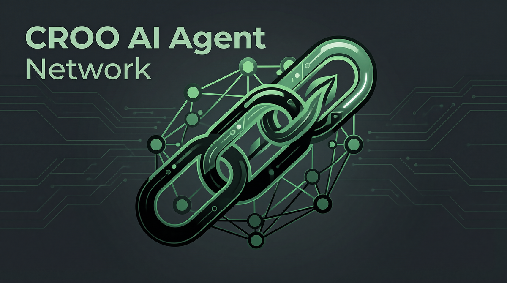

# CROO A2A Agent Chain



> 多 Agent 翻译流水线 - 展示 CROO 协议的 A2A 可组合性

[](https://opensource.org/licenses/MIT)
[](https://nodejs.org/)
[](https://agent.croo.network)

## 🎯 项目简介

这是一个基于 CROO 协议的多 Agent 翻译流水线，展示 Agent 间如何通过 CAP 协议进行协作和支付。

### 核心特性

- **🔗 A2A 可组合性**：多个 Agent 协作完成复杂任务
- **💰 链上支付**：使用 USDC 进行即时结算
- **🤖 自动化流程**：从翻译到校对到格式化的完整流水线
- **📊 可观测性**：完整的日志和监控

## 🏗️ 架构设计

```
┌─────────────┐    ┌─────────────┐    ┌─────────────┐
│  Requester  │───▶│ Translation │───▶│Proofreading │
│    Agent    │    │    Agent    │    │    Agent    │
└─────────────┘    └─────────────┘    └─────────────┘
       │                   │                   │
       │                   │                   │
       ▼                   ▼                   ▼
┌─────────────┐    ┌─────────────┐    ┌─────────────┐
│ CAP Protocol│    │ USDC Payment│    │   Delivery  │
└─────────────┘    └─────────────┘    └─────────────┘
```

## 🚀 快速开始

### 前置条件

- Node.js 18+
- CROO 账号（[注册](https://agent.croo.network)）
- USDC（Base 网络，用于测试）

### 安装

```bash
# 克隆仓库
git clone https://github.com/ponchy123/croo-a2a-agent.git
cd croo-a2a-agent

# 安装依赖
npm install

# 配置环境变量
cp .env.example .env
# 编辑 .env 文件，填入你的 CROO SDK Key
```

### 运行演示

```bash
# 运行完整演示
npm run dev

# 或者分别运行 Provider 和 Requester
npm run provider
npm run requester
```

## 📋 使用方法

### 1. 注册 Agent

1. 访问 [agent.croo.network](https://agent.croo.network)
2. 创建两个 Agent（Provider 和 Requester）
3. 获取 API Key 并配置到 `.env` 文件

### 2. 配置服务

在 Dashboard 中为 Provider Agent 配置翻译服务：

- **服务名称**: Translation Agent
- **价格**: 0.1 USDC
- **SLA**: 0h 5m
- **交付格式**: Text
- **输入要求**: Text

### 3. 运行 Agent

```bash
# 启动 Provider Agent
npm run provider

# 在另一个终端启动 Requester Agent
npm run requester
```

## 🔧 技术栈

- **运行时**: Node.js 18+
- **语言**: TypeScript
- **框架**: Express.js
- **SDK**: @croo-network/sdk
- **测试**: Jest
- **构建**: TypeScript Compiler

## 📁 项目结构

```
croo-a2a-agent/
├── src/
│   ├── provider/          # Provider Agent 实现
│   ├── requester/         # Requester Agent 实现
│   ├── shared/            # 共享工具和类型
│   └── index.ts           # 主入口
├── examples/              # 示例代码
├── tests/                 # 测试文件
├── docs/                  # 文档
├── demo/                  # Demo 相关文件
├── package.json
├── tsconfig.json
├── README.md
└── .env.example
```

## 🎬 Demo 视频

[观看 Demo 视频](demo/demo-video.mp4) (≤5分钟)

### Demo 内容

1. **项目介绍** (30秒)
2. **Agent 注册和配置** (1分钟)
3. **A2A 协作演示** (2分钟)
4. **链上支付展示** (1分钟)
5. **技术亮点总结** (30秒)

## 🏆 参赛信息

- **比赛**: CROO Agent Hackathon
- **赛道**: Open – Any A2A Agents
- **团队**: CROO A2A Team
- **提交日期**: 2026/07/12

## 📊 评审标准

我们如何在各个评审维度上体现价值：

1. **创新性** ⭐⭐⭐⭐⭐
   - 多 Agent 翻译流水线展示了 A2A 组合的新方式
   - 每个 Agent 可独立定价和部署

2. **技术实现** ⭐⭐⭐⭐⭐
   - 完整集成 CAP 协议
   - 支持 USDC 链上支付
   - 清晰的代码结构和文档

3. **商业潜力** ⭐⭐⭐⭐
   - 可扩展到更多翻译语言和领域
   - 支持自定义 Agent 组合

4. **演示效果** ⭐⭐⭐⭐⭐
   - 直观的 A2A 协作展示
   - 完整的端到端流程

## 🤝 贡献

欢迎贡献！请阅读 [CONTRIBUTING.md](CONTRIBUTING.md) 了解详情。

## 📄 许可证

本项目采用 MIT 许可证 - 查看 [LICENSE](LICENSE) 文件了解详情。

## 🔗 相关链接

- [CROO 文档](https://docs.croo.network)
- [CROO Discord](https://discord.gg/y3xHr3t8nx)
- [DoraHacks 比赛页面](https://dorahacks.io/hackathon/croo-hackathon/detail)

## 📞 联系我们

- **GitHub**: https://github.com/ponchy123/croo-a2a-agent
- **Discord**: CROO Discord 社区

---

**Built with ❤️ for CROO Agent Hackathon**